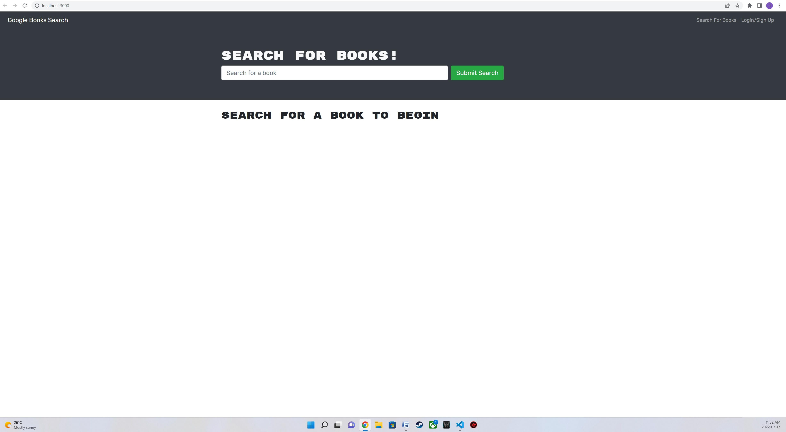
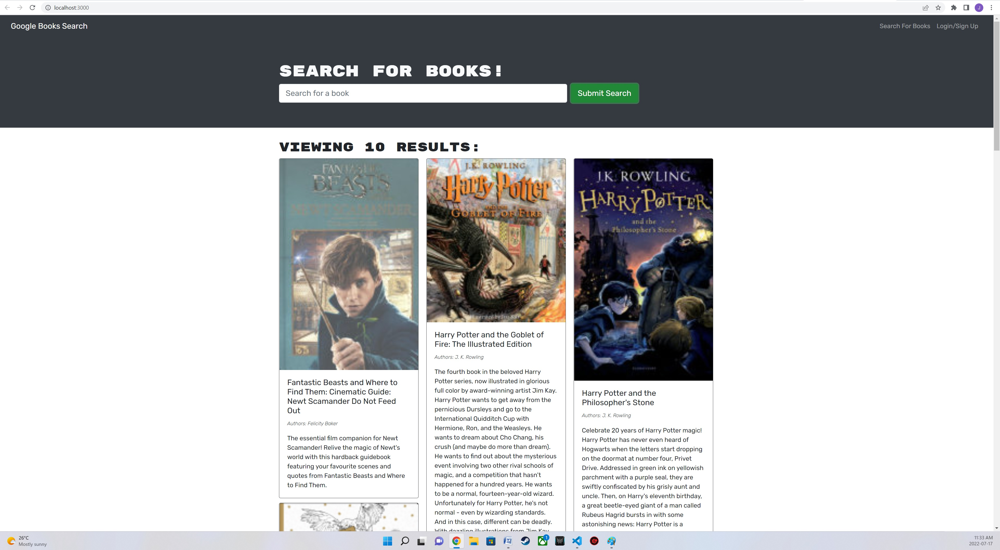

#  MERN Book Search

### MERN Challenge 21: Book Search Engine

## Project Description
This project will allow the user to search for books

## Installation
You can clone the project from GitHub by copying either HTTPS or SSH link or by downloading the project as a zip file. Run npm install do install needed packages. run npm run develop to start servers
  
## Deployed Website
https://mern-book-search-117.herokuapp.com/

## Screenshot
![Screenshot]

## Contribution
Made by Joe Chaaya

